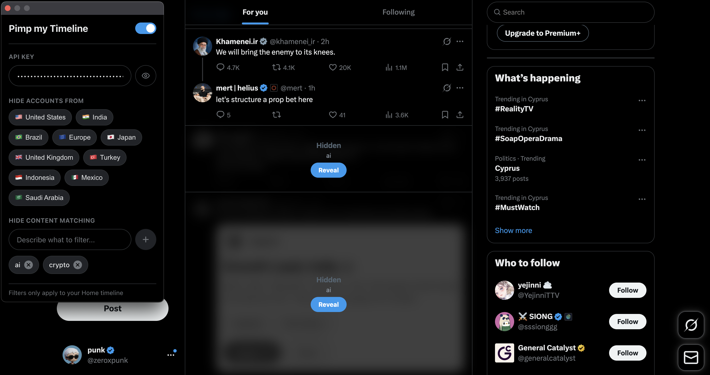

[](https://x.com/zeroxpunk)

# Pimp my Timeline



A simple Chrome extension, which helps you to get rid of garbage in your x.com Timeline.

### Features

- **Country filtering** — Hide tweets from users based on their account country;
- **Content filtering** — prompt custom content filtering rules. Powered by Gemini;

### Setup

First you need to obtain [Gemini API key](https://aistudio.google.com/apikey).

Then clone the repo

```bash 
git clone https://github.com/zeroxpunk/pimp-my-timeline.git
```

Then build from sources:

```bash
npm install
npm run build
```

And finally run the extension in your browser:

1. Open `chrome://extensions/`
2. Enable **Developer mode**
3. Click **Load unpacked** → select `dist` folder

## Contributing

Everyone's welcome. Feel free to fork and open PRs.

### Community Prompts

Check out the `prompts/` folder for ready-to-use filter rules:

- `hide-ai-slop.txt` — filters generic AI-generated content
- `hide-attention-farmers.txt` — filters engagement bait and rage farming

